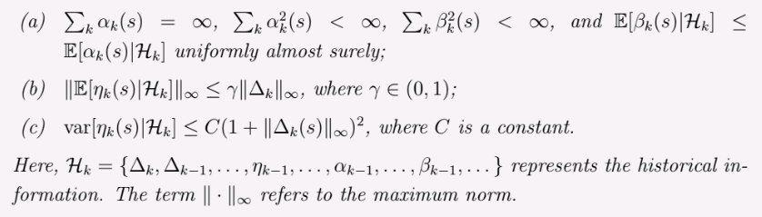

  <a href="ch5.html">&larr; Previous Chapter</a>
  <a href="ch7.html">Next Chapter &rarr;</a>

## Motivating Example: Mean Estimation

SUppose we have a random variable \\(X\\) which takes values from a finite set \\( \mathcal{X} \\). We want to estimate the mean \\( \mathbb{E}[X] \\) of this random variable. Suppose we also get i.i.d samples \\( \{x_i\}_{i=1}^n \\). In the [last chapter](ch5.html), we saw that we can estimate the mean using monte carlo estimation as follows:

$$
\begin{equation*}
\mathbb{E}[X] \approx \frac{1}{n} \sum_{i=1}^n x_i
\end{equation*}
$$

Even thouth this estimation becomes more accurate as \\(n \to \infty \\), it is not practical to wait for infinite samples. To overcome this, we can use an incremental update mechansism to update the estimate $w_k$ of the mean after every sample. We know that:

$$
\begin{equation*}
\begin{split}
    w_{k} &= \frac{1}{k-1} \sum_{i=1}^{k-1} x_i \hspace{1em} k = 2,3,\ldots \\
    w_{k+1} &= \frac{1}{k} \sum_{i=1}^k x_i, \hspace{1em} k = 1,2,\ldots
\end{split}
\end{equation*}
$$

Then, \\(w_{k+1} \\) can be written as:

$$
\begin{equation*}
\begin{split}
    w_{k+1} &= \frac{1}{k} \left( \sum_{i=1}^{k-1} x_i + x_k \right) \\
    &= \frac{1}{k} \left( (k-1) w_k + x_k \right) \\
    &= w_k - \frac{1}{k} (w_k - x_k)
\end{split}
\end{equation*}
$$

Therefore, we get our incremental algorithm for estimating the mean:

$$
\begin{equation*}
w_{k+1} = w_k + \frac{1}{k} (x_k - w_k)
\end{equation*}
$$

Even though, it is obvious that the initial estimates of the mean will be inaccurate, this algorithm will still converge to the true mean as \\(k \to \infty\\). Furthermore, we won't have to store all the samples, and wait for all the samples to arrive before we can update our estimate.

A more general form of this algorithm is:

$$
\begin{equation}
w_{k+1} = w_k + \alpha_k (x_k - w_k)
\label{Incremental Mean Estimation}
\end{equation}
$$

Here, the term \\( \frac{1}{k} \\) is replaced by a step size \\( \alpha_k > 0 \\). We will learn in this chapter that if \\( \alpha_k \\) satisfies some (very mild) conditions, then the algorithm will still converge to the true mean.

## Robbins-Monro Algorithm

Robbins-Monro (RM) algorithm is a stochastic roots finding algorithm and will later see that famous algorithms like Stochastic Gradient Descent (SGD) is a special case of this algorithm. Suppose that we need to find the root of the equation \\( g(w) = 0 \\), where \\( w \in \mathbb{R} \\) and \\( g: \mathbb{R} \to \mathbb{R} \\) is an unknown function. This means that we can't find a closed form solution for \\( w \\), neither can we calculate the derivative of \\( g(w) \\) to use other iterative methods. Furthermore, we can only obtain a noisy sample (with an observation error $\eta_k$) of the function value at a point \\( w \\) as follows:

$$
\begin{equation*}
\tilde{g}(w,\eta_k) = g(w_k) +  \eta_k
\end{equation*}
$$

The RM algorithm that solves this problem is:

$$
\begin{equation}
w_{k+1} = w_k - \alpha_k \tilde{g}(w_k, \eta_k) \hspace{1em} k = 1,2,\ldots
\label{RMalgorithm}
\end{equation}
$$

Here, \\(w_k\\) is the estimate of the root at iteration \\(k\\) and \\(\alpha_k > 0\\) is a positive coefficient. It is obvious that this alorithm converges only when certain conditions are satisfied (one obvious condition is that \\(g(w)\\) is monotonically increasing). But, before we discuss the conditions, let us first understand the intuition behind this algorithm by the following examples:

Suppose \\(w^\*\\) is the root of the equation \\(g(w) = 0\\):

1. When \\(w_k > w^\*\\), we have \\(g(w_k) > 0\\). Then, \\( w_{k+1} = w_k - \alpha_k g(w_k) < w_k\\). This means that we are moving towards the root if \\( \| \alpha_k g(w_k) \| \\) is sufficiently small.
2. When \\(w_k < w^\*\\), we have \\(g(w_k) < 0\\). Then, \\( w_{k+1} = w_k - \alpha_k g(w_k) > w_k\\). This means that we are moving towards the root if \\( \| \alpha_k g(w_k) \| \\) is sufficiently small.

In either case, we are moving towards the root.

Now, we can formally discuss the conditions under which the RM algorithm converges:

> **Theorem (Robbins-Monro Theorem)**: The Robbins-Monro algorithm stated in Equation $\eqref{RMalgorithm}$ converges almost surely to the root \\(w^\*\\) of the equation \\(g(w) = 0\\) if:
> 1. \\( 0< c_1 \leq \nabla_w g(w) \leq c_2 < \infty \\) for all \\(w\\).
> 2. \\( \sum_{k=1}^{\infty} \alpha_k = \infty \\) and \\( \sum_{k=1}^{\infty} \alpha_k^2 < \infty \\).
> 3. \\( \mathbb{E}[\eta_k | \mathcal{H}_k] = 0 \\) and \\( \mathbb{E}[\eta_k^2 | \mathcal{H}_k] < \infty \\) 
> where \\(\mathcal{H}_k = \{w_1, \ldots, w_k\}\\) is the history of the algorithm up to iteration \\(k\\). 

> **Proof**: Refer to the book chapter for the proof.

The conditions are explained as follows:

1. \\( 0< c_1 \leq \nabla_w g(w) \\) indicates that the function \\(g(w)\\) is monotonically increasing. This ensures that the root exists and is unique. \\
Furthermore, as an application where \\( g(w) = \nabla_w J(w) \\) for some cost function \\(J(w)\\), this condition ensures that the cost function is convex, which is a commonly adopted assumption in optimization problems. \\
The condition \\( \nabla_w g(w) \leq c_2 < \infty \\) ensures that the function is not too steep, or the gradient is bounded from above.

2. The second condition \\( \sum_{k=1}^{\infty} \alpha_k = \infty \\) and \\( \sum_{k=1}^{\infty} \alpha_k^2 < \infty \\) ensures that the series converges, but not too fast.\\
First, \\( \sum_{k=1}^{\infty} \alpha_k^2 < \infty \\) suggests that \\(\alpha_k \to 0\\) as \\(k \to \infty\\). This is necessary because \\(w_{k+1} - w_k = -\alpha_k g(w_k)\\) should go to zero as \\(k \to \infty\\) for the algorithm to converge.\\
Second, \\( \sum_{k=1}^{\infty} \alpha_k = \infty \\) ensures that the steps don't converge too fast and we reach the root from arbitrarily far away.

3. The third condition is a mild technical condition: \\( \mathbb{E}[\eta_k \| \mathcal{H}_k] = 0 \\) ensures that the noise is unbiased, i.e., the expected value of the noise is zero. This is necessary for the algorithm to converge to the true root. The low variance condition \\( \mathbb{E}[\eta_k^2 \| \mathcal{H}_k] < \infty \\) ensures that the noise is not too large, which could otherwise prevent the algorithm from converging.

Now it can be clearly seen that our $\eqref{Incremental Mean Estimation}$ algorithm is a special case of the RM algorithm where \\(g(w) = w - \mathbb{E}[X]\\) and therefore it converges if the conditions of the RM theorem are satisfied.

## Dvoretzky's convergence theorem

This section is a detour from the main topic, but this, along with some other results, is important for understanding the convergence of RL algorithms like Q-learning. Dvoretzky's convergence theorem can also be used to prove the convergence of the Robbins-Monro algorithm.

> **Theorem (Dvoretzky's Convergence Theorem)**: consider a stochastic process
>
>$$
\begin{equation*}
    \delta_{k+1} = (1-\alpha_k) \delta_k + \beta_k \eta_k
\end{equation*}
>$$
>
> where $\lbrace \alpha_k\rbrace_{k=1}^{\infty},\; \lbrace \beta_k\rbrace_{k=1}^{\infty},\; \lbrace \eta_k\rbrace_{k=1}^{\infty}$ are stochastic sequences with \\( \alpha_k, \beta_k \ge 0 \\) for all \\(k\\). Then, \\(\delta_k \to 0\\) almost surely if the following conditions are satisfied:
> 1. \\( \sum_{k=1}^{\infty} \alpha_k = \infty \\), \\( \sum_{k=1}^{\infty} \alpha_k^2 < \infty \\), and \\( \sum_{k=1}^{\infty} \beta_k^2 < \infty \\).
> 2. \\( \mathbb{E}[\eta_k \| \mathcal{H}_k] = 0 \\) and \\( \mathbb{E}[\eta_k^2 \| \mathcal{H}_k] \le C < \infty \\) for some constant \\(C\\) almost surely, and \\( \mathcal{H}_k\\) is the history of the process up to iteration \\(k\\).

These conditions have similar interpretations as the conditions in the Robbins-Monro theorem. Note that in Dvoretzky's theorem, \\(\alpha_k, \beta_k, \eta_k\\) are stochastic sequences, which means that they can vary randomly at each iteration. This is in contrast to the Robbins-Monro theorem, where \\(\alpha_k\\) is a deterministic sequence. Now, we can discuss a more general form of Dvoretzky's convergence theorem which incorporates multiple variables and is useful in proving the convergence of Q-learning algorithms.

> **Theorem (Generalized Dvoretzky's Convergence Theorem)**: Consider a stochastic process
>
>$$
\begin{equation*}
    \delta_{k+1}(s) = (1-\alpha_k(s)) \delta_k(s) + \beta_k(s) \eta_k(s)
\end{equation*}
>$$
>
> it holds that \\(\delta_k(s) \to 0\\) almost surely for all \\(s \in \mathcal{S}\\) if the following conditions are satisfied for all \\(s \in \mathcal{S}\\):

## Stochastic Gradient Descent

Consider the following optimization problem:

$$
\begin{equation*}
\min_{w} J(w) = \mathbb{E}[f(w, X)]
\end{equation*}
$$

where \\(w\\) is the model parameter to be optimized, \\(X\\) is a random variable, and \\(f(w, X)\\) is a scalar function and the expectation is with respect to \\(X\\). A straightforward way to solve this problem is to use the gradient descent algorithm:

$$
\begin{equation}
w_{k+1} = w_k - \alpha_k \nabla_w J(w_k) = w_k - \alpha_k \mathbb{E}[\nabla_w f(w_k, X)]
\label{Gradient Descent}
\end{equation}
$$

This is the gradient descent algorithm, which can find the optimal parameter \\(w^\*\\) under some mild conditions such as convexity of \\(f\\). One problem, though, is that calculating the expectation \\(\mathbb{E}[\nabla_w f(w_k, X)]\\) without the explicit knowledge of the distribution of \\(X\\) is not possible. Another way to calculate this expectation is to collect a large number of i.i.d samples \\(\lbrace x_i \rbrace_{i=1}^n\\) of X and approximate the expectation using monte carlo estimation:

$$
\begin{equation*}
\mathbb{E}[\nabla_w f(w_k, X)] \approx \frac{1}{n} \sum_{i=1}^n \nabla_w f(w_k, x_i)
\end{equation*}
$$

However, this method requires all the samples in each iteration, which is not practical. In practice, it might only be possible to collect one sample at a time. In this case, we can use the stochastic gradient descent (SGD) algorithm (which is a special case of the Robbins-Monro algorithm):

$$
\begin{equation}
w_{k+1} = w_k - \alpha_k \nabla_w f(w_k, x_k)
\label{SGD}
\end{equation}
$$

It is "stochastic" because it relies on a single stochastic sample \\(x_k\\) at each iteration to estimate the gradient. Now that we have replaced the expectation \\(\mathbb{E}[\nabla_w f(w_k, X)]\\) in the $\eqref{Gradient Descent}$ algorithm with a single sample gradient \\(\nabla_w f(w_k, x_k)\\) in the \\(\eqref{SGD}\\) algorithm, we might want to know if it still ensures convergence to the optimal parameter \\(w^\*\\) as \\(k \to \infty\\). The answer is yes, and here is the intuition behind it:

$$
\begin{equation*}
\begin{split}
\nabla_w f(w_k, x_k) &= \mathbb{E}[\nabla_w f(w_k, X)] + \left( \nabla_w f(w_k, x_k) - \mathbb{E}[\nabla_w f(w_k, X)] \right) \\
&= \mathbb{E}[\nabla_w f(w_k, X)] + \eta_k
\end{split}
\end{equation*}
$$

where \\(\eta_k = \nabla_w f(w_k, x_k) - \mathbb{E}[\nabla_w f(w_k, X)]\\) is the noise in the gradient estimate. Then, we can rewrite the SGD algorithm as:

$$
\begin{equation}
w_{k+1} = w_k - \alpha_k \nabla_w f(w_k, x_k) = w_k - \alpha_k \mathbb{E}[\nabla_w f(w_k, X)] + \alpha_k \eta_k
\end{equation}
$$

Hence, SGD alorithm is exactly the gradient descent algorithm apart from a perturbation term \\(\alpha_k \eta_k\\). Also, since the samples \\(x_k\\) are i.i.d, the noise \\(\eta_k\\) is zero mean:

$$
\begin{equation*}
\mathbb{E}[\eta_k] = \mathbb{E}[\nabla_w f(w_k, x_k)] - \mathbb{E}[\nabla_w f(w_k, X)] = 0
\end{equation*}
$$

Therefore, intuitively, the noise should not jeopardize the convergence of the SGD algorithm. 

## Convergence pattern of SGD

Intuitively, since SGD is a stochastic version of the gradient descent algorithm, with an added noise term, it should behave similarly to the gradient descent algorithm when the estimate \\(w_k\\) is far from the optimal parameter \\(w^\*\\). Aslo, it is obvious that the noise term will have a larger effect as the estimate \\(w_k\\) gets closer to the optimal parameter \\(w^\*\\). To understand the convergence pattern of SGD, we analyze the relative error between the stochastic and true gradients as:

$$
\begin{equation*}
\delta_k = \frac{\| \nabla_w f(w_k, x_k) - \mathbb{E}[\nabla_w f(w_k, X)] \|}{\| \mathbb{E}[\nabla_w f(w_k, X)] \|}
\end{equation*}
$$

since at the optimal solution \\(w^\*\\), we have \\(\mathbb{E}[\nabla_w f(w^\*, X)] = 0\\), we can rewrite the relative error as:

$$
\begin{equation*}
\delta_k = \frac{\| \nabla_w f(w_k, x_k) - \mathbb{E}[\nabla_w f(w_k, X)] \|}{\| \mathbb{E}[\nabla_w f(w_k, X)] - \mathbb{E}[\nabla_w f(w^*, X)] \|}
\end{equation*}
$$

Due to the [mean value theorem](https://en.wikipedia.org/wiki/Mean_value_theorem), we can write \\(\mathbb{E}[\nabla_w f(w_k, X)] - \mathbb{E}[\nabla_w f(w^\*, X)]\\) as \\(\mathbb{E}[\nabla^2_w f(\bar{w}_k, X)] (w_k - w^\*)\\) for some point \\(\bar{w}_k\\) between \\(w_k\\) and \\(w^\*\\). Therefore, we can rewrite the relative error as:

$$
\begin{equation*}
\delta_k = \frac{\| \nabla_w f(w_k, x_k) - \mathbb{E}[\nabla_w f(w_k, X)] \|}{\| \mathbb{E}[\nabla^2_w f(\bar{w}_k, X)] (w_k - w^*) \|}
\end{equation*}
$$

If \\(f\\) is strongly convex, then \\(\mathbb{E}[\nabla^2_w f(\bar{w}_k, X)]\\) is bounded from below by a positive constant \\(c > 0\\). Therefore, we can write:

$$
\begin{equation*}
\delta_k \leq \frac{ \| \overbrace{\nabla_w f(w_k, x_k)}^{\text{stochastic grad}} - \overbrace{\mathbb{E}[\nabla_w f(w_k, X)]}^{\text{true grad}} \|}{ \underbrace{c \| w_k - w^* \|}_{\text{distance to optimal solution}}}
\end{equation*}
$$

This shows that the relative error is inversely proportional to the distance to the optimal solution. Therefore, when the distance is large, \\(\delta_k\\) is small, and the stochastic gradient behaves similarly to the true gradient. However, as the distance decreases, the relative error increases, and the stochastic gradient deviates from the true gradient. This means that the convergence of SGD is slower when the estimate is close to the optimal solution.