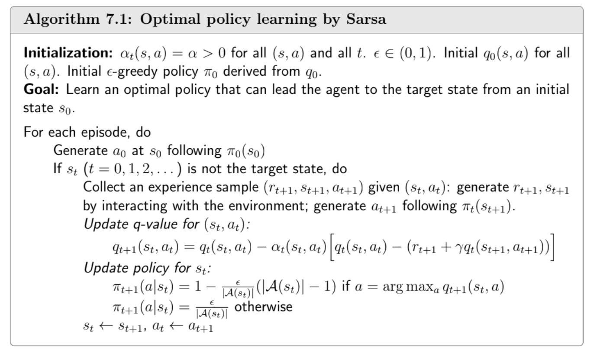
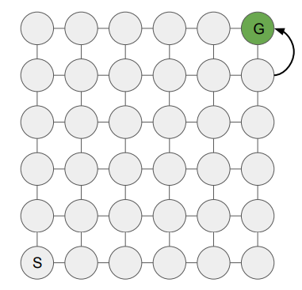
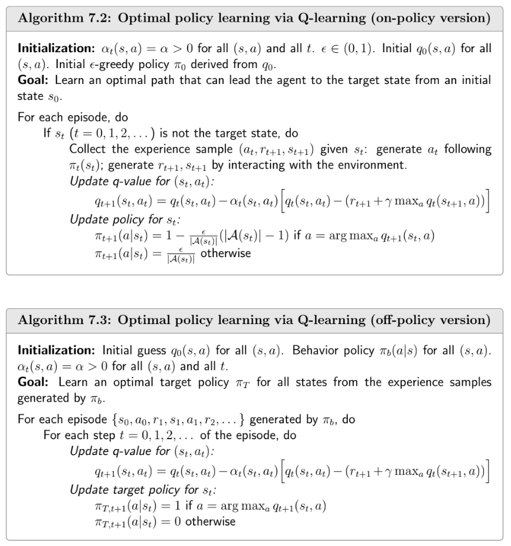

  <a href="ch6.html">&larr; Previous Chapter</a>
  <a href="ch8.html">Next Chapter &rarr;</a>

## TD learning of State Values
TD learning refers to a broad class of Reinforcement Learning algorithms that learn by bootstrapping from the current estimate of the value function.

For some policy $\pi$, we want to estimate the value $v^\pi(s)$ of all the states $s \in \mathcal{S}$.
Suppose we are given a sequence of states, actions and rewards $(s_0, a_0, r_1, s_1, a_1, r_2, \ldots)$ generated by following the policy $\pi$, we can construct a simple TD algorithm to estimate $v^\pi(s)$ as follows:

$$
\begin{align*}
v_{t+1}(s_t) &= v_t(s_t) - \alpha \big[v_t(s_t) - (r_{t+1} + \gamma v_t(s_{t+1}))\big] \\
v_{t+1}(s) &= v_t(s) \quad \text{for } s \neq s_t
\end{align*}
$$

Here, $v_t(s)$ is the estimate of $v^\pi(s)$ at time $t$, $\alpha$ is the step-size parameter.
This TD algorithm can be thought of as a special case of the [stochastic approximation algorithm](ch5.html#robbins-monro-algorithm) for solving the Bellman equation for $v^\pi$:

$$
\begin{align}
v^\pi(s) &= \mathbb{E}_\pi \big[ R_{t+1} + \gamma G_{t+1} \mid S_t = s \big] \\
&= \mathbb{E}_\pi \big[ R_{t+1} + \gamma v^\pi(S_{t+1}) \mid S_t = s \big]
\label{TD-value}
\end{align}
$$

This TD algorithm can be derived by applying robbins-monro algorithm to the above Bellman equation:

> For evey state, we define a function $$g(v_\pi(s)) = v_\pi(s) - \mathbb{E}_\pi \big[ R_{t+1} + \gamma v_\pi(S_{t+1}) \mid S_t = s \big]$$.
>
> Hence, the Bellman equation is equivalent to solving $$g(v_\pi(s)) = 0$$.
> Every timestep, we observe a noisy sample of $$g(v_\pi(s))$$:
>
>$$
\begin{equation*}
\begin{split}
\tilde{g}(v_\pi(s_t)) &= v_\pi(s_t) - (r_{t+1} + \gamma v_\pi(s_{t+1}))\\
&= \underbrace{\left( v_\pi(s_t) - \mathbb{E}\big[ R_{t+1} + \gamma v_\pi(s_{t+1}) \mid S_t = s_t \big] \right)}_{g(v_\pi(s_t))} + \underbrace{\left( \mathbb{E}\big[ R_{t+1} + \gamma v_\pi(s_{t+1}) \mid S_t = s_t \big] - (r_{t+1} + \gamma v_\pi(s_{t+1})) \right)}_{\eta_t}
\end{split}
\end{equation*}
>$$
>
> Therefore, Robbins-Monro algorithm for solving $g(v_\pi(s)) = 0$ gives us the TD update rule:
>
>$$
\begin{equation*}
\begin{split}
v_{t+1}(s_t) &= v_t(s_t) - \alpha \tilde{g}(v_t(s_t)) \\
&= v_t(s_t) - \alpha \big[v_t(s_t) - (r_{t+1} + \gamma v_\pi(s_{t+1}))\big]
\end{split}
\end{equation*}
>$$
>
> Note that this assumes that we alread have the correct value estimates for every other state $$s \neq s_t$$. If we were to estimate the value function for all states, there would have been $$v_{t}(s_{t+1})$$ instead of 
> $$v_\pi(s_{t+1})$$ in the above equation. Nevertheless, as shown later, this algorithm still converges to the correct value function if we estimate the value function for all states.

### Property analysis of TD algorithm

* **TD target**: The quantity $$\overline{v}_t = (r_{t+1} + \gamma v_t(s_{t+1}))$$ is called the TD target. It is the value that the algorithm is trying to make 
$v_t(s_t)$ approach. 

$$
\begin{equation*}
\begin{split}
v_{t+1}(s_t) - \overline{v}_t &= v_t(s_t) - \alpha \big[v_t(s_t) - (r_{t+1} + \gamma v_t(s_{t+1}))\big] - \overline{v}_t \\
&= v_t(s_t) - \overline{v}_t - \alpha (v_t(s_t) - \overline{v}_t) \\
&= (1 - \alpha)(v_t(s_t) - \overline{v}_t) \\
\implies \|v_{t+1}(s_t) - \overline{v}_t\| &= (1 - \alpha) \|v_t(s_t) - \overline{v}_t\|
\end{split}
\end{equation*}
$$

Therefore, for $0 < \alpha < 1$, the estimate $v_{t+1}(s_t)$ is closer to the TD target $\overline{v}_t$ than $v_t(s_t)$.

- **TD error**: The quantity $$\delta_t = r_{t+1} + \gamma v_t(s_{t+1}) - v_t(s_t)$$ is called the TD error. It is the difference between the TD target and the current estimate. TD error is 0 in expectation at the true value function.

$$
\begin{equation*}
\begin{split}
\mathbb{E}_\pi[\delta_t \mid S_t = s_t] &= \mathbb{E}_\pi[r_{t+1} + \gamma v_\pi(s_{t+1}) - v_\pi(s_t) \mid S_t = s_t] \\
&= 0
\end{split}
\end{equation*}
$$

- This TD algorithm can only estimate state values for a given policy $\pi$. It cannot be used to find the optimal value function $v^*$.

## SARSA - On-policy TD

SARSA (State-Action-Reward-State-Action) is a TD algorithm for estimating the action-value function $$q^\pi(s, a)$$ for a given policy $$\pi$$. It is a simple extension of the TD algorithm for state values discussed above.

$$
\begin{equation}
\begin{split}
q_{t+1}(s_t, a_t) &= q_t(s_t, a_t) - \alpha \big[q_t(s_t, a_t)  - (r_{t+1} + \gamma q_t(s_{t+1}, a_{t+1}))\big] \\
q_{t+1}(s, a) &= q_t(s, a) \quad \text{for } (s, a) \neq (s_t, a_t)
\end{split}
\label{SARSA}
\end{equation}
$$

Since SARSA requires the action $$a_{t+1}$$ taken in state $$s_{t+1}$$ using the policy $$\pi$$, it can't estimate the action values for any other policy. In other words, the behavior policy (the policy used to generate the data) and the target policy (the policy whose value function is being estimated) are the same. Hence, SARSA is an **on-policy algorithm**.

Mathematically, SARSA solves the Bellman evaluation equation for $$q^\pi$$:

$$
\begin{equation}
\begin{split}
q^\pi(s, a) &= \mathbb{E}_\pi \big[ R + \gamma q_\pi(S', A') \mid S = s, A = a \big]  \forall s \in \mathcal{S}, a \in \mathcal{A}(s)
\end{split}
\label{TD-action-value}
\end{equation}
$$

SARSA's convergence can be proven using the stochastic approximation framework, similar to the TD algorithm for state values. (see proof in book)

### Learning control using SARSA

Since SARSA estimates the action-value function $$q^\pi$$, this is like the policy evaluation step in the policy iteration algorithm. Therefore, we can use a policy improvement step to improve the policy $$\pi$$ along with SARSA to learn the optimal policy $$\pi^*$$.

Since SARSA is an on-policy algorithm (we need to use the policy $$\pi$$ to generate the data), we need to ensure that the policy has sufficient exploration at all times. Therefore, an $$\epsilon$$-greedy policy is used for $$\pi$$, where the greedy action is selected with probability $$1 - \epsilon$$ and a random action is selected with probability $$\epsilon$$.

Also, note that we are not running SARSA policy evaluation to convergence before improving the policy. Instead, we are interleaving the policy evaluation and policy improvement steps. This is based on the idea of **generalized policy iteration**.

### Expected SARSA

Expected SARSA is a variant of SARSA that uses the expected next action value instead of the sampled next action value in the update rule. The update rule for Expected SARSA is as follows:

$$
\begin{equation}
\begin{split}
q_{t+1}(s_t, a_t) &= q_t(s_t, a_t) - \alpha \big[q_t(s_t, a_t)  - (r_{t+1} + \gamma \mathbb{E}_\pi[q_t(s_{t+1}, A)])\big] \\
&= q_t(s_t, a_t) - \alpha \big[q_t(s_t, a_t)  - (r_{t+1} + \gamma \sum_{a} \pi(a \mid s_{t+1}) q_t(s_{t+1}, a))\big] \\
\end{split}
\label{Expected-SARSA}
\end{equation}
$$

Since this algorithm uses the expected next action value, it has lower variance than SARSA. Furthermore, it can be used with any behavior policy, not just the target policy. Hence, Expected SARSA is an **off-policy algorithm**.

### N-step updates in SARSA

**Credit assignment** is an important problem in Reinforcement Learning. It refers to the problem of determining which actions are responsible for the received rewards. In one-step TD methods like SARSA, credit flows back ony one step at a time. This can be slow in environments where rewards are sparse or delayed. for example, in a 6x6 grid:

<i> A 6x6 grid environment. The agent starts at S and needs to reach G to get a reward of +1. All other transitions give a reward of 0. Image taken from Prof. Machado's <a href="https://webdocs.cs.ualberta.ca/~machado/cmput628/w25/slides/lecture_9_25.pdf"> Lecture Notes </a> </i>

with a [random walk](https://en.wikipedia.org/wiki/Random_walk), the agent will need $$n^2$$ steps on average to reach the goal state, where $$n$$ is the distance from the start state to the goal state (12 steps in this case). Therefore, the agent will need to wait for 144 steps before it can update the value of the state only one step before the goal state. This can make learning very slow.

To counter this, we can use **n-step TD methods**. In n-step TD methods, credit flows back n steps at a time. This can make learning faster as the agent can update the value of states that are n steps away from the goal state. But, one needs to be careful while performing n-step updates as it requires careful rebalancing of the estimates (see [Importance Sampling](https://en.wikipedia.org/wiki/Importance_sampling)).

Taking this into consideration, n-step SARSA uses an n-step decomposition of the return to update the action-value function instead of the one-step decomposition used in SARSA:

$$
\begin{equation*}
\begin{split}
\text{SARSA} \leftarrow G_t^{(1)} &= R_{t+1} + \gamma q_t(S_{t+1}, A_{t+1}) \\

G_t^{(2)} &= R_{t+1} + \gamma R_{t+2} + \gamma^2 q_t(S_{t+2}, A_{t+2}) \\

& \vdots \\

\text{n-step SARSA} \leftarrow G_t^{(n)} &= R_{t+1} + \gamma R_{t+2} + \ldots + \gamma^{n-1} R_{t+n} + \gamma^n q_t(S_{t+n}, A_{t+n}) \\

& \vdots \\

\text{Monte Carlo} \leftarrow G_t^{(\infty)} &= R_{t+1} + \gamma R_{t+2} + \gamma^2 R_{t+3} + \ldots

\end{split}
\end{equation*}
$$

Therefore, the update rule for n-step SARSA is as follows:

$$
\begin{equation}
\begin{split}
q_{t+n}(s_t, a_t) &= q_t(s_t, a_t) - \alpha \big[q_t(s_t, a_t)  - r_{t+1} - \gamma r_{t+2} - \ldots - \gamma^{n-1} r_{t+n} - \gamma^n q_t(s_{t+n}, a_{t+n})\big] \\
\end{split}
\label{n-step-SARSA}
\end{equation}
$$

Therefore, to update the action-value function for a state-action pair, we need to wait for n steps to get the n-step return. This can make learning faster as the agent can update the value of states that are n steps away from the goal state. But, it also increases the variance of the updates as we are using more random variables (rewards and next action values) in the update.

## Q-learning

In contrast to SARSA which learns the action-value function for the policy used to generate the data, Q-learning aims to solve the Bellman optimality equation and learn the optimal action-value function $$q^*$$ directly:

$$
\begin{equation}
\begin{split}
q_{t+1}(s_t, a_t) &= q_t(s_t, a_t) - \alpha \big[q_t(s_t, a_t)  - (r_{t+1} + \gamma \max_{a} q_t(s_{t+1}, a))\big] \\
q_{t+1}(s, a) &= q_t(s, a) \quad \text{for } (s, a) \neq (s_t, a_t)
\end{split}
\label{Q-learning}
\end{equation}
$$

Here, the action-value function is updated towards the maximum action-value of the next state, instead of the action-value of the action taken in the next state as in SARSA. Therefore, Q-learning is an **off-policy algorithm** as it can learn the optimal policy regardless of the policy used to generate the data.

