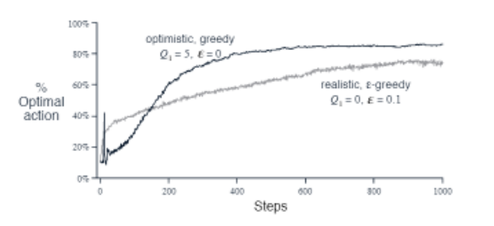
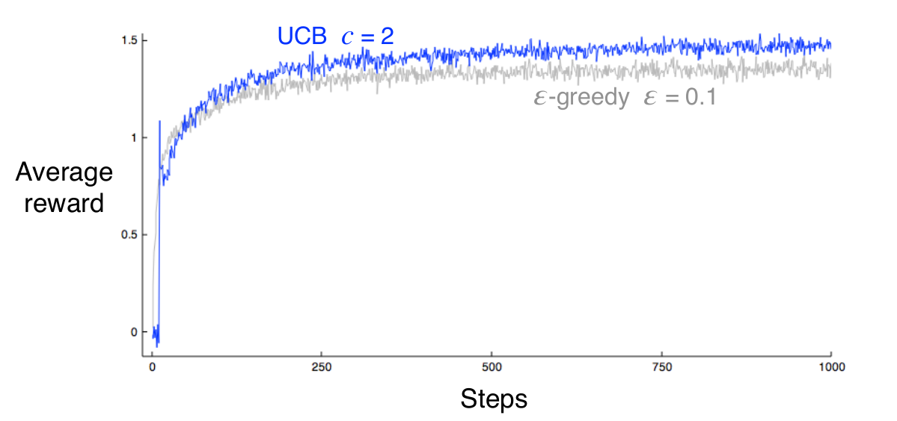

## The k-armed Bandit Problem

In a k-armed bandit problem, we are repeatedly faced with a choice among k different options, or actions. After each choice we receive a numerical reward chosen from a stationary probability distribution that depends on the action we selected. Our objective is to maximize the expected total reward over some time period.

In our k-armed bandit problem, we have a set of k actions, each of which yields a reward selected from a stationary probability distribution. Let $q_*(a)$ denote the expected reward for selecting action $a$. We assume that we do not know the true value of $q_*(a)$ for any of the actions. We denote the estimated value of action $a$ at time step $t$ by $Q_t(a)$. We would like $Q_t(a)$ to be close to $q_*(a)$.

## Action-value Methods

Action-value methods are a class of reinforcement learning methods that estimate the value of each action. The most straightforward action-value method is to estimate the value of each action by averaging the rewards actually received:

$$
Q_t(a) \dot{=} \frac{\text{sum of rewards when a taken prior to t}}{\text{number of times a taken prior to t}}
$$

Now, we can use the estimated action values to select an action. One method is to select the action with the highest estimated action value:

$$
A_t \dot{=} \underset{a}{\operatorname{argmax}} Q_t(a)
$$

A simple alternative is to behave greedily most of the time, but every once in a while, with small probability $\epsilon$, instead select randomly from among all the actions with equal probability, independently of the action-value estimates. This method is called $\epsilon$-greedy action selection.
An advantage of these methods is that in limit as the number of steps increases, every action will be sampled an infinite number of times, guaranteeing that all the $Q_t(a)$ converge to $q_*(a)$.

>*Exercise 2.1* In $\epsilon$-greedy action selection, for the case of two actions and $\epsilon = 0.5$, what is the probability that the greedy action is selected?

>*Solution* The probability that the greedy action is selected is $1 - \epsilon + \frac{\epsilon}{2} = 0.75$.

>*Exercise 2.3* In the comparison shown in Figure 2.2, which method will perform best in the long run in terms of cumulative reward and probability of selecting the best action? How much better will it be? Express your answer quantitatively.

>*Solution* The $\epsilon$-greedy method with $\epsilon = 0.01$ will perform best in the long run. 
This is because it will select the best action 99% of the time, while the other method will select the best action only 90% of the time.

## Incremental Implementation

Read from the textbook.

## Tracking a Nonstationary Problem

Read from the textbook.

## Optimistic Initial Values

One way to encourage exploration is to set the initial action values to high numbers. This will cause the agent to try actions that it has not tried before, because it will initially think that they have high value. This method is called optimistic initial values.

### Bias introduced

All the methods we have discussed so far (sample avg, constant step-size, optimistic initial values) have a bias towards the initial action values. For sample avg, the bias on action-value disappears as soon as that action is selected. For constant step-size the bias is permanent, but decreases over time.

> in practice, this kind of bias is not really a problem and sometimes can be helpful. The dwnside is that the initial estimates become, in effect, a set of parameters that must be picked by the user. The upside is that they provide an easy way to supply some prior knowledge about what level of rewards can be expected.

Suppose for example in the 10 armed bandit problem (in the textbook) we know that the rewards are always between 0 and 1 and we set the initial action values to 5, this would be wildly optimistic. But this optimism would be helpful in encouraging exploration. Even with the greedy policy, the agent would try an action, get "disappointed" due to low reward, and then try another action.

This simple trick is effective in stationary problems, but not in nonstationary problems. Indeed, any method that focuses on initial conditions in a special way is likely to be ineffective in nonstationary problems.

>*Exercise 2.6* *The mysterious spikes* The results shown in Figure 2.3 should be quiet reliable because they are averages over 2000 individual, randomly chosen 10-armed bandit tasks. Why, then, are there oscillations and spikes in the early part of the curve for the optimistic method? In other words, what might make this method perform particularly better or worse, on average, on particular early steps?

>*Solution* The spikes might be caused by the fact that the optimistic method is more likely to select the optimal action in the early steps. Due to the initial setup, it might try the optimal action, get disappointed, and then try some suboptimal action that has higher value estimate (due to inital setup). This would cause the spike.

>*Exercise 2.7* *Unbiased constant-step-size trick* in most of this chapter, we have used sample averages to estimate the action values because sample averages do not produce the initial bias that constant step sizes do (see the analysis leading to (2.6)). However, sample averages are not a completely satisfactory solution because they may perform poorly on nonstationary problems. Is it possible to avoid the bias of constant step sizes while retaining their advantages on nonstationary problems? One way is to use a step size of
>$$
\beta_t \doteq \alpha / \bar{o}_t
$$
>to process the t-th reward for a particular action, where α > 0 is a conventional constant step size, and $\bar{o}_t$ is a trace of one that starts at 0:
>$$
\bar{o}_t \doteq \bar{o}_{t-1} + \alpha (1 - \bar{o}_{t-1}), \text{ for } t \geq 0, \text{ with } \bar{o}_0 \doteq 0.
$$
>Carry out an analysis like that in (2.6) to show that $Q_t$ is an exponential recency-weighted average without initial bias.

> *Solution* TODO

## Upper-Confidence-Bound Action Selection

$\epsilon$-greedy action selection forces the non-greedy actions to be tried, but indiscriminately, with no preference for those that are nearly greedy or particularly uncertain. The idea of upper-confidence-bound (UCB) action selection is to select among the non-greedy actions according to their potential for actually being optimal, taking into account both how close their estimates are to being maximal and the uncertainties in those estimates. One way of implementing this idea is to select action $A_t$ as

$$
A_t \dot{=} \underset{a}{\operatorname{argmax}} \left[ Q_t(a) + c \sqrt{\frac{\ln t}{N_t(a)}} \right]
$$

where $c > 0$ controls the degree of exploration, $N_t(a)$ is the number of times that action $a$ has been selected prior to time $t$, and $\ln t$ is the natural logarithm of $t$.

If $N_t(a) = 0$, then $a$ is considered to be a maximizing action.

The idea is that each time an action $a$ is selected, the uncertainty is presumably reduced. Each time an action other than $a$ is selected, however, the uncertainty about $a$ increases because the numerator increases, but the denominator does not.

As the timesteps increase, $\ln t$ grows slower than $N_t(a)$, so the second term in the brackets goes to zero. This means that the action selection is greedy with respect to the estimated action values.

> *Exercise 2.8* *UCB Spikes* In Figure 2.4 the UCB algorithm shows a distinct spike in performance on the 11th step. Why is this? Note that for your answer to be fully satisfactory, it must explain both why the reward increase on the 11th step and why it decreases on the subsequent steps. Hint: If c = 1, then the spike is less prominent.
>
> 
>
> *Solution* The spike is caused by the fact that for the first 10 timesteps, each action is selected once. After that, the action with the highest upper confidence bound is selected. This action is the one with the highest value estimate (likely the optimal action). The subsequent decline is because eventually the uncertainty of the optimal action will reduce and the agent will start to explore other actions with higher uncertainty.
