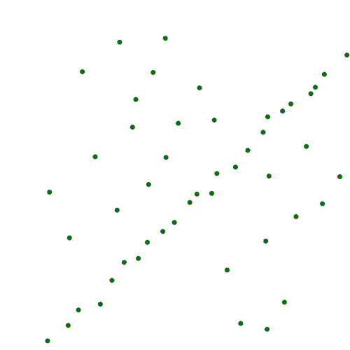

## The voting system

In the year 2999, in an alternate reality, when everyone is fed up with the imperial governments, a new form of government is proposed. With the imperial government, most of the problems arise due to the incompetency of the ruler, who is selected by the previous king. The people, who this new king would rule over, have no say in the selection process. 

To remove this paradox, mathematicians propose a new form of government called **Consensus Government**. The main idea behind this consensus government would be that people would choose their own ruler.

## How will the consensus government work?

According to the proposal, the consensus government will have two types of rulers, *temporary rulers (TRs)* and a *king*. The temporary rulers will rule the country for a *grace period* of 4 months, and once a temporary ruler is promoted to the king, he will go on and rule the country for 10 years till the next elections.

Statisticians who have proposed the system believe that everyone among the population should have an equal chance to become a ruler, and therefore, the temporary rulers will be chosen uniformly at random from the people of the country. Once the selected person steps up as a TR, he will have 4 months to please the people. At the end of his 4-month term, there will be a final judgment day when people either promote him to a king's position or dethrone him.

If he is dethroned, the process is repeated again until the country has a suitable ruler. On the contrary, if he is promoted, he rules the country for 10 years till the next election, when the whole process is repeated.

## Some obvious flaws

As you might have noticed already, there are some obvious flaws in this system. First of all, there can be a significant economic burden of conducting the judgment day's voting every 4 months. Moreover, since random people are chosen to be made the temporary ruler, the selected person might have to give up his/her day job to become a ruler. Therefore, the system needs to account for the job security of the people who are elected.

Apart from these minor flaws, there is a major flaw in the system. A temporary ruler's main objective is to put a 4-month effort to sway the judgment day voting to his favour. This can be done in various ways, one of which is pleasing people with your work. Another way of achieving this might be committing mass murder of the people who don't support you before the judgement day arrives.

Because of these flaws and the potential risk of civil wars every 4-months, the system is discarded. But, the statisticians feel that there is more to it; they believe that there is a takeaway message. This system would work if humans are not allowed to commit mass murder (or if the sample is not changing), i.e. the population from which the person is sampled to become a temporary ruler is the same as the population voting on the judgement day. These are the conditions that datapoints usually satisfy. Therefore, we can deduce an algorithm which tries to find a model that fits (or pleases) our data points best.

## RANSAC, Finally!!

Everything you have read till now might even be useless if you don't like to see things from an unconventional perspective but, I assure you that I won't deviate from the topic anymore.

RANdom SAmple Consensus, or RANSAC, is an iterative algorithm to estimate parameters of a mathematical model (For example the task in the consensus government example was to find the best fit for the king). For understanding the algorithm, we will take the task of fitting a line to given datapoints. We will also see that how RANSAC performs in the presence of outliers and do an analysis of its convergence.

### The algorithm:
As such, the RANSAC algorithm is quite simple. We iteratively sample random samples from our sample and try to fit our model to that data. We find the number of inliers with our fitted model and pick the model which has maximum number of inliers.

For example, in the case of line fitting, we pick two random points from the sample space, try to fit a line on to them. We call the points having distance \\(< \epsilon \\) from the fitted line inliers. We do this for \\(N\\) iterations and pick the line with the maximum number of inliers.

<i>RANSAC in working. Source: </i><a href="http://www.visual-experiments.com/tag/ransac/"><i>visual-experiments.com</i></a>

The above gif shows RANSAC in working. In each iteration, 2 points are chosen at random and a *blue line* is fitted. Blue points are the inliers for the blue line and the red ones are the outliers. The green line shows the best line (the line with most inliers) till that iteration.

As you might have noticed, RANSAC is a non deterministic algorithm which has some probability of success which increases with number of iterations.

### Analysis of the convergence

Before the analysis, let us report the result:
RANSAC will converge in

\\[N \le \frac{log(1-p)}{log(1-(1-e)^s)} \\]

steps. Here, \\(p \\) is the probability with which we want our algorithm to give correct output, \\(e \\) is the probability of a data point being outlier and \\(s\\) is the size of our sample (for eg, 2 in the case of line fitting).

Assuming that the algorithm best fits the mathematical model only if at least one of the \\(N\\) samples is outlier free. Therefore, we want the probability to have at least one outlier free sample in \\(N\\) iterations to be greater than \\(p\\). In other words, the probability of having at least one outlier in all of the samples to be less than \\((1-p)\\).

Now, if \\(e\\) is the probability of a data point being outlier, \\((1-e)\\) is the probability of it being an inlier. Then, \\((1-e)^s\\) becomes the probability of all the points in a sample being inliers. \\((1-(1-e)^s)\\) is the probability of having at least one outlier in the sample. And, \\((1-(1-e)^s)^N\\) extends this idea to all the samples in \\(N\\) iterations *i.e.* at least one data point in all samples is an outlier.

Therefore,

\\[(1-(1-e)^s)^N \le 1-p\\]

\\[\implies N \le \frac{log(1-p)}{log(1-(1-e)^s)} \\]

## Why RANSAC?

While reading this, the question that might have come to your mind is why should one use RANSAC? There clearly are many better methods to perform line fitting, like Linear Regression etc., then what makes RANSAC different and what is its application?

RANSAC is primarily used to discard outliers from a set of datapoints that are expected to adhere to a mathematical model and find the parameters to the model that fit the inliers best. Typical applications of RANSAC can be found in the [Fudamental Matrix](https://en.wikipedia.org/wiki/Fundamental_matrix_(computer_vision)#:~:text=The%20fundamental%20matrix%20is%20a%20relationship%20between%20any%20two%20images,can%20occur%20in%20both%20images.) / [Homography](https://en.wikipedia.org/wiki/Homography) computation in Epipolar geometry (Things that can't be computed using other methods like regression).

## Final Thoughts

Epipolar geometry and Computer Vision have huge applicability in modern world. Given enough time, we would like to talk more about these in the future. We suggest reading the book *Multiple View Geometry in Computer Vision* to expand one's knowledge about these topics.

In future, we might also talk about why humans fight wars, would they ever stop and what is AI's role to play in it.

*For any issues, suggestions, or questions, reach out to us at* roomnumber308@gmail.com.